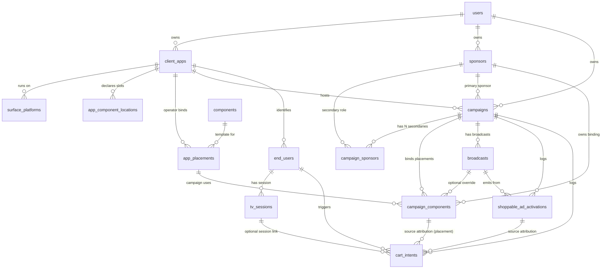

# DB & Endpoints — Developer Reference

Reference map for anyone (new dev, Kotlin dev, integration partner) working
on the Vio backend or the SDKs that consume it. Focus is on the **product
placement + multi-sponsor + cart-intent** slice.

> ⚠️ **Updated 2026-04-28**. The placement model pivoted from "self-service
> SDK declares full placements" to "dashboard-driven; SDK declares only
> locations". Migration `0004_named_placements_consolidation.sql` drops
> `app_components`, adds `app_placements` as the source of truth, and
> rewrites `campaign_components` to FK into placements. **The architecture
> diagram + flow live in `CURRENT_STATE.md` §17 (canonical)**. This doc
> covers schema + endpoint shapes; treat §17 as the design contract.

Cross-refs:
- Architecture flow: **`CURRENT_STATE.md` §17** (canonical)
- Conceptual model: [`multi-sponsor-architecture.md`](./multi-sponsor-architecture.md)
- End-to-end cart-intent: `VioSwiftSDK/Documentation/CART_INTENT_FLOW.md`
- Apple TV SDK runtime: `InteractiveAds-vio/docs/SDK_ARCHITECTURE.md`
- Kotlin SDK specs: [`KOTLIN_TV_SDK_SPEC.md`](./KOTLIN_TV_SDK_SPEC.md), [`KOTLIN_MOBILE_SDK_SPEC.md`](./KOTLIN_MOBILE_SDK_SPEC.md)

---

## 1. Hierarchy in one picture

```
┌─────────────────────────────────────────────────────────────┐
│  users  (operator accounts — dashboard auth)                │
└─┬───────────────────────────────────────────────────────────┘
  │ owns
  ├─► client_apps   ────────── tvEnabled, webhookUrl, apiKey ──┐
  │   │                                                         │
  │   │ SDK boot uploads slots                                  │ calls
  │   ├─► app_component_locations  ← {locationId, displayName,  │ backend
  │   │                              deprecated_at}             │ with
  │   │                                                         │ apiKey
  │   │ operator creates from dashboard (not SDK)               │
  │   ├─► app_placements  ← named instances:                    │
  │   │                     {component_id, location_id, name,   │
  │   │                      deprecated_at}                     │
  │   │   Dual UNIQUE (per-app):                                │
  │   │     (name)  +  (component_id, location_id)              │
  │   │                                                         │
  │   └─► campaigns                                             │
  │       │   primarySponsorId (NOT NULL, immutable)            │
  │       │                                                     │
  │       ├─► campaign_sponsors (M:N secondary sponsors)        │
  │       │                                                     │
  │       ├─► campaign_components  ← campaign bindings:         │
  │       │     {app_placement_id, sponsor_id, status,          │
  │       │      customConfig:{productIds, title?,              │
  │       │                    showSponsorLogo?, …},            │
  │       │      scheduledTime?, broadcastId?}                  │
  │       │   Partial UNIQUE: only ONE active per               │
  │       │     (campaign_id, app_placement_id) at a time       │
  │       │                                                     │
  │       ├─► broadcasts   (live events under the campaign)     │
  │       │     │                                               │
  │       │     ├─► broadcast_sponsor_slots  (shoppable TV ads) │
  │       │     ├─► polls, contests          (engagement)       │
  │       │     └─► shoppable_ad_activations (dispatch log)     │
  │       │                                                     │
  │       └─► cart_intents (attribution log)                    │
  │                                                             │
  └─► sponsors  ──────── avatarUrl, logoUrl, commerceApiKey ────┘
         (the brand — per-sponsor Commerce credentials live here)
```

**Rule of thumb per table**:
- `users` = dashboard operator account (one human).
- `client_apps` = **a surface**: the publisher property where Vio runs (TV2, Viaplay, a website), with its own `apiKey`. It is NOT one native app — see `surface_platforms`.
- `surface_platforms` = the platforms of a surface (web / ios / android / vev / *-tv), each with its own identifier.
- `sponsors` = a brand **as sold through one Commerce channel** (`commerceApiKey`). One Commerce user may own several channels, so a sponsor maps to a channel, not to a user.
- `campaigns` = time-bounded marketing activation under an app with 1 primary + N secondary sponsors.
- `components` = platform-wide read-only library of canonical templates (`is_template = true`): countdown, offer_banner, product_banner, product_carousel, product_spotlight, product_store. Vio admin edits via SQL only.
- `app_component_locations` = slot ids the SDK declared at boot (sync-semantic).
- `app_placements` = named instances bound by operator (template × location × name). Created via dashboard `/apps/:id` form.
- `campaign_components` = which `app_placement` runs in which campaign with which sponsor + customConfig.
- `broadcasts` = a live event under a campaign (a match, a show).
- `end_users` = an SDK viewer identity (opaque externalUserId, per client_app).
- `tv_sessions` = active TV SDK session (for heartbeat + cart-intent routing).
- `shoppable_ad_activations` = one row per shoppable ad dispatch.
- `cart_intents` = one row per "Add to cart" tap with full attribution.
- ~~`app_components`~~ = **DROPPED in migration 0004** (redundant with `app_placements`). Endpoints return HTTP 410 Gone.

---

## 2. Schema diagram (tables + FKs relevant to the flow)



### 2.1 Column summary (key columns only)

#### `client_apps` (= a **surface**)
`id, userId → users, name, bundleId (LEGACY, nullable since 0010), apiKey, webhookUrl, partnerDeviceRegisterUrl, tvEnabled, tvPlatforms (text[], LEGACY)`

- `bundleId` used to be NOT NULL, which forced every surface to look like one
  native app — it was in practice holding slugs (`viaplay-demo`, `tv2demo`).
  Real identifiers now live per platform.
- `apiKey` stays **per surface** (not per platform), so SDK bootstrap is unchanged.

#### `surface_platforms` (migration 0010)
`id, surfaceId → client_apps (CASCADE), kind ('web' | 'ios' | 'android' | 'vev' | 'apple-tv' | 'android-tv' | 'fire-tv'), identifier (nullable), enabled, createdAt`

- One surface spans many platforms: VG = web + iOS + Android. `identifier` is the
  bundle id / package name / domain / Vev project id — different per platform,
  which is why it cannot live on the surface.
- Partial UNIQUE: one row per `(surface, kind)` while `identifier IS NULL`;
  several identifiers of the same kind allowed (e.g. two web domains), never duplicated.
- `tvEnabled`/`tvPlatforms[]` were the bolted-on precursor; 0010 backfilled them as rows.

#### `sponsors`
`id, userId → users, name, logoUrl, avatarUrl, primaryColor, secondaryColor, commerceApiKey, commerceChannelId, paymentMethods (json: ['card','klarna','vipps','apple_pay','google_pay'])`

- `avatarUrl` = square brand mark (overlays / product cards).
- `logoUrl` = wide horizontal logo (headers / full-screen).
- `commerceApiKey` present → sponsor can drive shoppable flows. Null → inert: the
  dashboard marks it *Not connected* and blocks it in the campaign picker, since a
  campaign bound to it would render no products.
- The key identifies a **channel**, not a brand: one Commerce user may own several
  channels with different keys, so *which* key is pasted decides which catalog the
  campaign sells from. Entered by hand — it cannot be derived from a Commerce user.

#### `campaigns`
`id, userId, clientAppId → client_apps, primarySponsorId → sponsors (NOT NULL, immutable once children exist), name, startDate, endDate, isPaused, targetCountries (text[]), webhookUrl`

#### `campaign_sponsors` (M:N)
`id, campaignId → campaigns, sponsorId → sponsors, role ('engagement' | 'shoppable' | 'full')`

#### `components` (catalog, platform-wide)
`id varchar PK default gen_random_uuid(), type (product_carousel | product_spotlight | product_store | product_banner | product_slider | banner | countdown | offer_banner | offer_badge | …), name, config (json), is_template boolean NOT NULL default false, created_at`

`is_template = true` means this row is a canonical platform-wide template that any client app can register via the SDK manifest. Custom (non-template) rows are app-scoped and not exposed to the dashboard's "Add placement" picker.

#### `app_components` — **DROPPED** (migration 0004)
Fully redundant with `app_placements` post-pivot. A placement row implies the
app supports the underlying template; the explicit "this app uses this
template" link is no longer needed. Routes that referenced this table return
HTTP 410 Gone.

#### `app_component_locations` (manifest-populated)
`id serial PK, client_app_id → client_apps, location_id varchar NOT NULL, display_name varchar NULLABLE, deprecated_at timestamp NULLABLE, created_at, updated_at` — **UNIQUE `(client_app_id, location_id)`** (`idx_app_component_locations_unique`).

Populated by the SDK manifest at app boot via `POST /v2/mobile/components/manifest`. Lists which slot ids the app's UI exposes (`Vio.registerPlacementLocation(_:)`).

**Sync semantics**: locations not present in a new manifest payload get `deprecated_at = now()`. Re-uploading the same id clears the flag. `display_name` is refreshed on every upload.

The dashboard's "Add from library" form's location picker reads from here filtered by `deprecated_at IS NULL`.

#### `app_placements` ⭐ the named-instance table (migration 0004)
| column | type | notes |
|---|---|---|
| `id` | serial PK | row id |
| `client_app_id` | integer FK → `client_apps` | NOT NULL, ON DELETE CASCADE |
| `component_id` | varchar FK → `components` | the canonical template (`is_template = true`) |
| `location_id` | varchar(100) | the slot (matches `app_component_locations.location_id` when active) |
| `name` | varchar(255) | human-friendly label, e.g. "Carrusel home" |
| `custom_config` | json NULLABLE | optional per-instance config baseline (rarely used; campaign-level overrides preferred) |
| `deprecated_at` | timestamp NULLABLE | soft-delete; existing campaign uses keep rendering with a warning |
| `created_by` | integer FK → `users` | audit (operator user id at create time) |
| `created_at`, `updated_at` | timestamp | row audit |

**Two UNIQUE indexes**:
- `idx_app_placements_unique_name` on `(client_app_id, name)` — name is the human id, unique per app.
- `idx_app_placements_unique_slot` on `(client_app_id, component_id, location_id)` — slot is unique per app. For A/B variants, declare distinct location_ids (`home_top_a`, `home_top_b`).

Created by **operator/admin via dashboard** (`POST /api/client-apps/:id/placements`), NOT by the SDK manifest. Service-layer validation rejects with stable error codes:
- `PLACEMENT_LOCATION_INVALID` — locationId not declared (or deprecated)
- `PLACEMENT_TEMPLATE_INVALID` — componentId not in canonical library (`is_template = true`)
- `PLACEMENT_NAME_COLLISION` — name already used by another active placement
- `PLACEMENT_SLOT_COLLISION` — slot already claimed by another active placement
- `PLACEMENT_NOT_FOUND` — for delete (soft-delete via DELETE endpoint)

#### `campaign_components` ⭐ the campaign-binding table
| column | type | notes |
|---|---|---|
| `id` | serial PK | per-instance id |
| `campaign_id` | integer FK → `campaigns` | NOT NULL |
| `app_placement_id` | integer FK → `app_placements` | NOT NULL, ON DELETE RESTRICT (post-migration 0004; replaces the old component_id + location_id pair) |
| `sponsor_id` | integer FK → `sponsors` | **NOT NULL** (Phase 3). Must be primary or in `campaign_sponsors` — enforced by `isSponsorAllowedForCampaign` |
| `broadcast_id` | varchar FK → `broadcasts` **nullable** | null = campaign-wide, set = broadcast-scoped override |
| `instance_name` | varchar nullable | UX label distinct from app_placement.name (e.g. "Carrusel home — XXL drop") |
| `status` | varchar NOT NULL default `'inactive'` | `active` \| `inactive` |
| `custom_config` | json nullable | operator overlay (e.g., `{"productIds": [...]}`); merged with `components.config` server-side before SDK consumption |
| `scheduled_time` | timestamp nullable | auto-activate at this time (legacy column, used by `server/scheduler.ts`) |
| `end_time` | timestamp nullable | auto-deactivate at this time (legacy) |
| `scheduled_start_time`, `scheduled_end_time` | timestamp nullable | newer scheduling pair — both columns coexist; scheduler reads `scheduled_time + end_time` |
| `activated_at` | timestamp nullable | last activation timestamp |
| `updated_at` | timestamp NOT NULL | row last-modified (touched by every PATCH) |
| `video_start_time`, `video_end_time` | integer | seconds relative to broadcast video |
| `match_id` | varchar nullable | optional external match id |
| `created_by` | integer FK → `users` | audit (operator user id at create time, post-migration 0004) |

**Multi-sponsor "one active per (campaign, placement)"** — partial UNIQUE index `idx_campaign_components_one_active` on `(campaign_id, app_placement_id) WHERE status = 'active'`. Enforces that only one row per placement can be `active` at a time; rotation is done by toggling status / scheduling other rows. Backend pre-checks and returns `PLACEMENT_ACTIVE_CONFLICT` (HTTP 409) before hitting the DB constraint, so the dashboard gets a friendlier error.

The `component_id` and `location_id` columns are **gone** — info lives on the linked `app_placement` row. Storage's `getCampaignComponents` synthesizes them on read for callers that haven't migrated.

#### `broadcasts`
`broadcast_id varchar PK, campaign_id → campaigns nullable, channel_id, broadcast_name, description, start_time, end_time, status (upcoming | live | ended), metadata (json), engagement_enabled boolean, show_lineup boolean, viewer_count, peak_viewers, started_at, match_starting_at, home/away_team_name + _logo, league_name, sportmonks_fixture_id, external_id, created_at, updated_at`

#### `end_users`
`id, clientAppId → client_apps, externalUserId varchar (opaque partner user id), firstSeenAt, lastSeenAt, metadata (json)` — unique on `(clientAppId, externalUserId)`.

#### `tv_sessions`
`id, clientAppId, endUserId → end_users, tvDeviceId, platform (apple-tv | android-tv), startedAt, lastSeenAt, endedAt`

#### `shoppable_ad_activations`
`id, broadcastId, campaignId, sponsorId, clientAppId, slotId → broadcast_sponsor_slots nullable, productId (external Commerce id), productSnapshot (json), sponsorSnapshot (json), source (admin-api | dashboard | tv-sdk | slot-scheduler), wsEventSent, triggeredAt`

One row per shoppable ad dispatch. `productSnapshot` + `sponsorSnapshot` freeze the data at dispatch time for audit.

#### `cart_intents`
`id, end_user_id → end_users, campaign_id, client_app_id, tv_session_id → tv_sessions nullable, sponsor_id nullable, product_id varchar, source_activation_id → shoppable_ad_activations nullable, source_component_id → campaign_components nullable, delivery_mode (websocket | dual | webhook | apns | dropped), user_connected boolean, envelope (json, canonical v1), metadata json, triggered_at`

`source_activation_id` closes the TV → Mobile attribution chain. `source_component_id` closes the placement → cart attribution chain.

#### `broadcast_sponsor_slots` (shoppable TV ads, scheduled or manual)
`id, broadcast_id, sponsor_id, campaign_id nullable, role default 'shoppable', trigger_type ('manual'|...), trigger_value, auto_execute boolean, product_ids integer[] default {}, status default 'scheduled', executed_at, type default 'product', config json default {}, created_at`

Each slot is a pre-configured shoppable ad attached to a broadcast. `POST /api/broadcasts/:broadcastId/sponsor-slots/:slotId/execute` dispatches it (writes `shoppable_ad_activations` + WS fan-out).

#### `polls` and `contests`
Both engagement tables include `sponsor_id NOT NULL` (per-question sponsorship). Schema columns: `id, broadcast_id, … , scheduled_start_time, scheduled_end_time, sponsor_id NOT NULL, video_start_time, video_end_time, is_active`. Fully out-of-scope of the placement subsystem — listed here so the relationship to `sponsors` is visible.

---

## 3. Endpoints by audience

Auth column: `apiKey` = `X-API-Key` header; `session` = dashboard cookie; `Bearer` = JWT.

### 3.1 Admin / app setup (session)

| method | path | what |
|---|---|---|
| GET | `/api/client-apps` | list apps |
| GET | `/api/client-apps/with-stats` | list apps with placement / campaign counts |
| POST | `/api/client-apps` | create surface. Accepts `platforms[]` (`{kind, identifier}`); `bundleId` no longer required |
| GET | `/api/client-apps/:id` | app detail |
| PATCH | `/api/client-apps/:id` | update app |
| POST | `/api/client-apps/:id/regenerate-key` | rotate apiKey |
| DELETE | `/api/client-apps/:id` | delete app |
| PUT | `/api/client-apps/:id/platforms` | replace the surface's platform set (`{platforms:[{kind,identifier}]}`) |
| GET | `/api/client-apps/:id/channels` | reachu channels linked to this app |
| GET | `/api/client-apps/:id/campaigns` | campaigns owned by this app (clientAppId-linked + channel-linked) |
| GET | `/api/client-apps/:id/component-locations` | list slots declared by SDK manifest. Default filters out `deprecated_at IS NOT NULL`; pass `?includeDeprecated=true` to see all. Source for the dashboard's "Add from library" form's location picker. |
| GET | `/api/client-apps/:id/placements` | list named placements (post-migration 0004). Returns rows joined with the canonical template. `?includeDeprecated=true` includes soft-deleted. |
| POST | `/api/client-apps/:id/placements` | **create named placement** (body: `componentId`, `locationId`, `name`, `customConfig?`, `createdBy?`). Validation errors return HTTP 400 with `code` ∈ {PLACEMENT_LOCATION_INVALID, PLACEMENT_TEMPLATE_INVALID, PLACEMENT_NAME_COLLISION, PLACEMENT_SLOT_COLLISION}. |
| DELETE | `/api/client-apps/:id/placements/:placementId` | **soft-delete** placement (sets deprecated_at). Existing campaign_components keep rendering with a warning. Emits WS `app_placement_deprecated` per affected campaign. |
| GET / POST / DELETE | ~~/api/client-apps/:id/components[…]~~ | **HTTP 410 Gone** post-migration 0004 — the legacy `app_components` table is dropped. Use the placements endpoints above. |
| GET | `/api/components` | list catalog templates |
| GET | `/api/components/usage` | catalog usage stats |
| GET | `/api/components/:id` | template detail |
| GET | `/api/components/:id/availability` | availability check (used by the Add-placement form) |
| POST | `/api/components` | create catalog template |
| PATCH | `/api/components/:id` | update template — **fires WS `component_config_updated`** if the template is in use by an active campaign |
| DELETE | `/api/components/:id` | delete template |

### 3.2 Dashboard operator (session)

#### Sponsors
| method | path | what |
|---|---|---|
| GET / POST | `/api/sponsors` | list / create sponsor |
| GET / PATCH / DELETE | `/api/sponsors/:id` | detail / update / delete |
| GET | `/api/campaigns/:id/sponsors` | sponsors linked to campaign (primary + secondaries as one array since PR #21) |
| POST | `/api/campaigns/:id/sponsors` | add secondary sponsor |
| DELETE | `/api/campaigns/:id/sponsors/:sponsorId` | remove secondary |
| GET | `/api/campaigns/:id/secondary-sponsors` | secondaries only (legacy view; prefer `/sponsors`) |
| POST / DELETE | `/api/campaigns/:id/secondary-sponsors[/:sponsorId]` | secondary CRUD (legacy) |

#### Campaigns
| method | path | what |
|---|---|---|
| GET / POST | `/api/campaigns` | list / create |
| GET | `/api/campaigns/:id` | detail with sponsors |
| GET | `/api/campaigns/:id/stats` | counters (broadcasts, placements, etc.) |
| GET | `/api/campaigns/:id/broadcasts` | broadcasts under this campaign |
| GET | `/api/campaigns/:id/events` | dispatch / activation log |
| PUT | `/api/campaigns/:id` | update (immutable primary sponsor if children exist) |
| DELETE | `/api/campaigns/:id` | delete cascade |
| PATCH | `/api/campaigns/:id/toggle-pause` | pause/resume |
| GET / PUT | `/api/campaigns/:id/engagement-config` | engagement settings (polls/contests on/off, etc.) |
| GET / PUT | `/api/campaigns/:id/ui-config` | brand/theme overrides |
| GET / PUT | `/api/campaigns/:id/feature-flags` | per-campaign flags |

#### Placements (`campaign_components`)
| method | path | what |
|---|---|---|
| GET | `/api/campaigns/:id/components` | list placements joined with `app_placements` + canonical template |
| GET | `/api/campaigns/:id/active-components` | list currently active |
| POST | `/api/campaigns/:id/components` | **create placement** (post-migration 0004 body: `appPlacementId`, `sponsorId?` (defaults to campaign primary), `customConfig?`, `instanceName?`, `status?`, `broadcastId?`, `createdBy?`). Validates: placement matches campaign's clientApp + sponsor in campaign_sponsors. If `status='active'` is requested, returns HTTP 409 `PLACEMENT_ACTIVE_CONFLICT` if another row is already active for `(campaign, app_placement)`. |
| PATCH | `/api/campaigns/:id/components/:rowId` | **`:rowId` is the campaign_components row PK** (not the template id, post-migration 0004). Toggle status. Atomic: emits `placement_status_changed` via outbox in the same tx as the UPDATE. Pre-checks `PLACEMENT_ACTIVE_CONFLICT` (HTTP 409). |
| POST | `/api/campaigns/:id/components/:rowId/pause` | Sugar verb for `status='inactive'`. Same outbox contract as PATCH. |
| POST | `/api/campaigns/:id/components/:rowId/resume` | Sugar verb for `status='active'`. Pre-checks active-conflict. Same outbox contract. |
| POST | `/api/campaigns/:id/placements/:appPlacementId/activate` | Multi-sponsor rotation. Body: `{ campaignComponentId }`. Atomic A→B swap inside one tx (deactivate old, activate new). Emits a single `placement_activation_swapped` event with both ids + sponsorIds + the new component shape. Idempotent if target is already active and no other contender exists. |
| PATCH | `/api/campaigns/:id/components/:rowId/config` | Override `customConfig` (productIds, title, showSponsorLogo, layout, autoPlay, …) **and optionally** `sponsorId` for in-place sponsor swap. Body: `{ customConfig, sponsorId? }`. When `sponsorId` differs from the row's current sponsor, validates against `campaign_sponsors` (must be primary or secondary) and updates in place. Emits a single `placement_config_updated` event covering both diffs (`sponsorId` + `sponsorChanged: bool` in payload so the SDK reroutes commerce). Only emits when the row is active. |
| DELETE | `/api/campaigns/:id/components/:rowId` | remove placement (hard delete of the campaign binding; the underlying app_placement is untouched). |

#### Scheduled placements (separate scheduling surface)
| method | path | what |
|---|---|---|
| GET | `/api/campaigns/:id/scheduled-components` | list scheduled placement runs |
| POST | `/api/campaigns/:id/scheduled-components` | schedule a placement window |
| PATCH | `/api/scheduled-components/:id` | reschedule / update |
| DELETE | `/api/scheduled-components/:id` | cancel |

This is parallel to `campaign_components.scheduledTime` — kept for the dashboard's calendar view. If you only need a one-shot start/end window, prefer setting `scheduledTime + endTime` on the `campaign_components` row directly.

#### Broadcasts
| method | path | what |
|---|---|---|
| GET / POST | `/api/broadcasts` | list / create |
| GET / PUT / DELETE | `/api/broadcasts/:broadcastId` | detail / update / delete |
| GET | `/api/broadcasts/:broadcastId/analytics` | viewer counts / chart data |
| GET / POST | `/api/broadcasts/:broadcastId/sponsor-slots` | list / create shoppable ad slots |
| PUT / DELETE | `/api/broadcasts/:broadcastId/sponsor-slots/:slotId` | update / delete slot |
| POST | `/api/broadcasts/:broadcastId/sponsor-slots/:slotId/execute` | dispatch slot now |
| POST | `/api/broadcasts/:broadcastId/trigger-shoppable-ad` | ad-hoc dispatch |
| GET | `/api/broadcasts/:broadcastId/shoppable-ads` | activation log |
| GET / POST | `/api/broadcasts/:broadcastId/{polls,contests,ads,products,chat}` | engagement / chat CRUD |
| PUT | `/api/broadcasts/:broadcastId/match-data` | sportmonks fixture data |

#### Form persistence (dashboard UX state)
| method | path | what |
|---|---|---|
| POST | `/api/form-state` | save dashboard form draft |
| GET | `/api/form-state/:campaignId/:formType` | load specific draft |
| GET | `/api/form-state/:campaignId` | list drafts for a campaign |

### 3.3 Admin programmatic API (Bearer JWT)

Used by external tooling / partner automation that doesn't go through the dashboard UI.

| method | path | what |
|---|---|---|
| POST | `/v2/admin/broadcasts/:broadcastId/shoppable-ad` | programmatic shoppable-ad dispatch (replaces the legacy `/api/broadcasts/:id/shoppable-ad` which no longer exists) |
| POST / GET / PUT / DELETE | `/v1/broadcasts[/:broadcastId]` | broadcast CRUD |
| GET | `/v1/campaigns/:campaignId/broadcasts` | broadcasts under a campaign |
| POST / GET / PUT / DELETE | `/v1/broadcasts/:broadcastId/polls` + `/v1/polls/:pollId` | poll CRUD |
| GET | `/v1/polls/:pollId/results` | poll results |
| POST / GET / PUT / DELETE | `/v1/broadcasts/:broadcastId/contests` + `/v1/contests/:contestId` | contest CRUD |
| GET | `/v1/contests/:contestId/participations` | contest entries |

### 3.4 SDK v2 runtime (apiKey)

| method | path | what |
|---|---|---|
| GET | `/v2/mobile/config` | **bootstrap**: active campaign + primary + secondaries + endpoints |
| GET | `/v2/mobile/broadcasts/:broadcastId/capabilities` | per-broadcast feature flags |
| GET | `/v2/mobile/broadcasts/:broadcastId/components` | broadcast-scoped placements (legacy path, may retire) |
| GET | `/v2/mobile/campaigns/:campaignId/components` | **primary placement fetch** — campaign-scoped instances joined through `app_placements`. Backend filters out where `app_placements.deprecated_at IS NOT NULL`. Response includes `appPlacementId + appPlacementName + locationId` + sponsor block (logoUrl + avatarUrl) + template config merged with customConfig. |
| POST | `/v2/mobile/components/manifest` | **SDK boot location manifest** — body must be `{ locations: [{id, displayName?}, …] }`. Sync semantics: locations not in payload get `deprecated_at = now()` (soft). **Rejects body with `placements[]` or `components[]`** (HTTP 400) — those legacy arrays were retired post-migration 0004. |
| POST | `/v2/mobile/campaigns/:campaignId/register-device` | APNs/FCM token registration for push fallback |
| POST | `/v2/mobile/campaigns/:campaignId/cart-intent` | mobile cart-intent |
| POST | `/v2/tv/broadcast/subscribe` | **TV combined bootstrap** — subscribe + session + wsUrl + identify in one call |
| POST | `/v2/tv/session/{start,heartbeat,end}` | TV session lifecycle |
| POST | `/v2/tv/cart-intent` | TV cart-intent (v2 minimal body: `{ externalUserId, productId, activationId }`) |
| POST | `/v2/tv/broadcasts/:broadcastId/shoppable-ad` | TV SDK ad dispatch |

### 3.5 Commerce proxy (apiKey)

| method | path | what |
|---|---|---|
| GET | `/v2/commerce/products` | raw Commerce GraphQL proxy (debug) |
| GET | `/v2/commerce/sponsors/:sponsorId/catalog` | sponsor-scoped product catalog (used by the dashboard product picker via `useSponsorCatalog`) |

### 3.6 Legacy v1 SDK surface (apiKey, deferred retirement)

These endpoints are still in use by the iOS SDK for unmigrated feature domains. Tracked in [`IOS_V2_MIGRATION_GAP.md`](./IOS_V2_MIGRATION_GAP.md). Do **not** point new SDKs (Kotlin) at these — they're scheduled to retire as their feature domains migrate.

| method | path | feature domain |
|---|---|---|
| GET | `/v1/sdk/config` | bootstrap (replaced by `/v2/mobile/config`) |
| GET | `/v1/sdk/campaigns` | campaign discovery |
| GET | `/v1/sdk/broadcast?contentId=…` | Viaplay content-id lookup |
| GET | `/v1/sdk/components` | placements (replaced by `/v2/mobile/campaigns/:id/components`) |
| GET | `/v1/sdk/livescores` | sport scores ticker |
| GET | `/v1/sdk/broadcasts/:broadcastId/{lineup,chat,score,stats}` | per-broadcast feature data |
| GET | `/v1/campaigns/:campaignId/config` | brand/theme |
| GET | `/v1/engagement/config` | engagement config |
| GET | `/v1/engagement/{polls,contests}` | engagement lists |
| POST | `/v1/engagement/polls/:pollId/vote` | poll voting (rate-limited) |
| POST | `/v1/engagement/contests/:contestId/participate` | contest entry (rate-limited) |
| GET | `/v1/localization/:language` | i18n strings |
| GET | `/v1/offers` | offer banner content |

---

## 4. WebSocket events

All WS connections target `wss://<host>/ws/:campaignId`. The client identifies with `{ type: "identify", userId }` after handshake so the backend can route user-scoped events. v2026-04-28+ SDKs additionally send `{ type: "subscribe", modules:["placements","cart_intent",…] }` so the server filters every emit by the socket's module set.

### Outbound (server → client)

Sprint 2026-04-28 PM split outbound events into module buckets. The 3 `placement_*` events are emitted via the **outbox pattern** (atomic with the data UPDATE; see §1.5 below). Legacy events stay on the firehose for backward compat.

| event | module | payload root | when |
|---|---|---|---|
| `campaign_started` | (firehose) | `campaignId, startDate, endDate, matchId?` | campaign starts |
| `campaign_ended` | (firehose) | `campaignId, endDate` | campaign ends |
| `broadcast_status_changed` | (firehose) | `broadcastId, status` | status transitions (upcoming → live → ended) |
| `placement_status_changed` | `placements` | `campaignId, appPlacementId, campaignComponentId, status: 'active'\|'inactive', module, serverTimestamp` | pause / resume from dashboard or sugar verbs |
| `placement_config_updated` | `placements` | `…, customConfig, productIdsChanged: bool, sponsorId: int?, sponsorChanged: bool, module, serverTimestamp` | customize dialog save (customConfig and/or sponsor swap) |
| `placement_activation_swapped` | `placements` | `…, fromCampaignComponentId, toCampaignComponentId, fromSponsorId, toSponsorId, newComponent:{id,componentTypeId?,sponsorId?,customConfig,status}, module, serverTimestamp` | atomic A→B swap on `POST /placements/:appPlacementId/activate` |
| `poll_activated` / `poll_deactivated` | (firehose, future `engagement`) | `pollId, broadcastId` | engagement |
| `contest_activated` / `contest_deactivated` | (firehose, future `engagement`) | `contestId, broadcastId` | engagement |
| `lineup_show` | (firehose, future `broadcast`) | `broadcastId, videoTimestamp, …` | lineup scheduling |
| `shoppable_ad` | (firehose, future `broadcast`) | `broadcastId, campaignId, sponsorId, activationId, product, sponsor` | shoppable ad dispatch (TV SDK) |
| `cart_intent` | direct unicast (future `cart_intent`) | `vio_notification_version, vio_event_type, vio_payload:{…, activation_id, sponsor_id}` | direct to identified user |
| `ping` | — | — | app-level keepalive (client responds `{type:"pong"}`) |

> Legacy `component_status_changed` / `component_config_updated` wire types pre-Sprint-2026-04-28 are no longer emitted by the backend. Their decoders remain on the SDK as inert source-compat shims.

### Inbound (client → server)

| event | payload | when |
|---|---|---|
| `identify` | `userId` | first frame after handshake |
| `subscribe` | `modules: string[]` (subset of `["placements","engagement","broadcast","cart_intent"]`) | second frame on v2026-04-28+ SDKs; tells the server to filter every emit by the socket's module set. Sockets that skip this stay on the firehose for backward compat. |
| `pong` | — | in response to `ping` |

### 1.5. `events_outbox` (the realtime backbone)

Every realtime event the server emits is staged in `events_outbox` first.
HTTP handlers INSERT into this table inside the same Drizzle transaction
as the data change, guaranteeing atomicity (an event will be emitted
iff the data change committed).

| column | type | notes |
|---|---|---|
| `id` | uuid PK | `gen_random_uuid()` |
| `topic` | text | wire `type` value, e.g. `'placement_status_changed'` |
| `module` | text | bucket: `'placements'` \| `'engagement'` \| `'broadcast'` \| `'cart_intent'` |
| `scope_type` | text | routing target: `'campaign'` \| `'broadcast'` \| `'user'` |
| `scope_id` | bigint | numeric id of the routing target (`campaign.id`, `end_users.id`, …) |
| `payload` | jsonb | per-topic shape (see types in `server/events/types.ts`) |
| `server_timestamp` | timestamptz | INSERT time; the SDK uses this for sequencing |
| `status` | text | `'pending'` → `'sent'` (success) \| `'failed'` (transient) \| `'dead'` (max attempts exceeded) |
| `attempts` | integer | retry counter (max 5 before `dead`) |
| `last_error` | text? | error message from the last failed attempt |
| `created_at` | timestamptz | |
| `processed_at` | timestamptz? | when the worker shipped (or marked dead) |

Indexes:
- `events_outbox_pending_idx` on `created_at` WHERE status='pending' (worker hot path)
- `events_outbox_scope_idx` on `(scope_type, scope_id, server_timestamp DESC)` (audit / replay)

Worker: `server/events/worker.ts` polls every 500ms with `FOR UPDATE SKIP LOCKED LIMIT 50` so multi-node deploys process disjoint row sets. Dispatch routes by `scope_type`: `'campaign'` → `broadcastToCampaign(scope_id, message, module)`. `'broadcast'` and `'user'` are reserved for future modules.

Migration: `migrations/0005_events_outbox.sql`.

---

## 5. Placement lifecycle for SDK developers (post-pivot 2026-04-28)

```
   Dev                Operator (dashboard)             Operator (campaign)
   │                  │                                │
   ▼                  ▼                                ▼
SDK boot          /apps/:id "Add from library"    /campaigns/:id "Add"
manifest          (template + locationId + name)  (placement + sponsor + products)
   │              │                                │
   ▼              ▼                                ▼
locations[]     app_placements row              campaign_components row
                                                (status=inactive by default)
                                                     │
                                                     ▼
                                          PATCH .../components/:rowId
                                          { status: 'active' }
                                                     │
                                                     ▼
                                       fires WS `component_status_changed`
                                                     │
                                                     ▼
                                       ┌──────────────────────────────┐
                                       │ SDK runtime:                 │
                                       │ 1. initial fetch (bootstrap) │
                                       │ 2. listen WS, upsert state   │
                                       │ 3. render by locationId      │
                                       └──────────────────────────────┘
```

**0. Boot — slot manifest upload.** App init calls `Vio.registerPlacementLocation(_:)` for each slot the layout exposes, then `VioPlacementManifestUploader` POSTs `/v2/mobile/components/manifest` with `{ locations: [...] }`. Backend upserts `app_component_locations`. Sync semantics: locations not in the new payload get `deprecated_at = now()`.

**1. Initial fetch.** As part of `fetchAndApplySdkBootstrapNow`, the SDK calls `GET /v2/mobile/campaigns/:campaignId/components`. Backend JOINs `campaign_components → app_placements → components` and `→ sponsors`; filters out where `app_placements.deprecated_at IS NOT NULL`; merges `templateConfig + customConfig` overlay. Response includes `appPlacementId + appPlacementName + locationId` + sponsor block (logoUrl + avatarUrl) + merged config. SDK upserts `activeComponents`, deduping by `(id, locationId)` composite key.

**2. WS updates.** SDK connects to `wss://<host>/ws/:campaignId`, sends `{type:"identify", userId}`. Listens for:
- `component_status_changed` — placement activate/deactivate; payload carries `appPlacementId`, `locationId`, `componentId` (template uuid), `status`, `component:{id,type,name,config}`.
- `component_config_updated` — operator changed `customConfig` (productIds, title, showSponsorLogo, …); SDK re-renders.
- `app_placement_deprecated` — operator soft-deleted a placement; live SDKs drop any active components keyed off this placement.

**3. Scheduler-driven.** `server/scheduler.ts` runs periodically; when `campaign_components.scheduled_time` is reached it flips status → active and emits the WS event. At `end_time` flips to inactive.

**4. Render.** Each UI slot (`VProductCarousel(locationId: "home_top")` etc.) calls `getActiveComponent(type:locationId:)` against the local placement map. If found and `active`, render. Carousel reads `customConfig.title` + `customConfig.showSponsorLogo` for an optional header (sponsor logo via `VioConfiguration.shared.sponsor(withId: comp.sponsorId).logoUrl` → SVG-capable `VRemoteImage`). Products load via `ProductService.loadProducts(sponsorId: comp.sponsorId)` routed through the per-sponsor commerce key.

**5. Missing or offline.** If no placement for a `locationId`, render nothing. If WS drops, poll `/v2/mobile/campaigns/:campaignId/components` on reconnect to re-sync.

---

## 6. Cart-intent attribution chain

```
shoppable_ad dispatched (slot, tv-sdk, dashboard, admin-api)
  → shoppable_ad_activations INSERT (id = X)
  → WS `shoppable_ad` { activationId: X, sponsorId, product } to connected clients
  ↓
user taps "Add to cart" (TV SDK or mobile placement)
  → POST /v2/tv/cart-intent { externalUserId, productId, activationId: X }
        (TV path)
  → POST /v2/mobile/campaigns/:campaignId/cart-intent
        (in-app placement path)
  ↓
backend:
  → resolve campaignId + sponsorId from activation row
  → ensureEndUser
  → INSERT cart_intents { sourceActivationId: X, sponsorId, deliveryMode, envelope }
  → forward envelope to mobile (direct WS or webhook/APNs)
  ↓
mobile SDK receives WS `cart_intent`
  → dedup by activationId
  → open product detail with sponsor.id → per-sponsor Commerce client
  → Apple Pay gate reads paymentMethods from sponsor block
```

Also supported: placement-originated cart intents carry `sourceComponentId` (the placement row id) instead of `sourceActivationId`.

---

## 7. How-to recipes

### Add a sponsor to a campaign
1. Sponsor exists in `sponsors` (created in Sponsors page).
2. Dashboard → campaign detail → **Sponsors** tab → Add → pick sponsor + role (`shoppable` / `engagement` / `full`).
3. Backend: `POST /api/campaigns/:id/sponsors { sponsorId, role }` → inserts `campaign_sponsors`.

### Add a placement to an app (post-pivot 2026-04-28 flow)

**Dev side (one-time per slot the app's UI exposes):**
1. Pick a stable `locationId` (e.g. `home_top`, `match_pre_kickoff`).
2. Add `Vio.registerPlacementLocation(VioPlacementLocation(id: ..., displayName: ...))` to the boot helper.
3. Render the placement view at that slot: `VProductCarousel(locationId: "home_top")`.
4. Cold-start the app — SDK uploads the locations manifest. Done from dev side.

**Operator side (one-time per placement, in dashboard):**
5. `/apps/:id` → Placements section → "Add from library".
6. Pick template (Product Carousel / Banner / etc.) + the locationId from the dev-declared list + a human name (e.g., "Carrusel home").
7. Saved → row in `app_placements`. Available to all campaigns of this app.

(Library is read-only for operators — only Vio admin edits via SQL.)

### Bind a placement to a campaign
1. Campaign has ≥1 sponsor (`campaign_sponsors`).
2. App has ≥1 named placement (previous recipe).
3. Dashboard → campaign → **Components** tab → "Add Component". Pick:
   - Placement (one of the named app_placements)
   - Sponsor (campaign primary or one of the secondaries)
   - Products (only if placement type is `product_*`)
   - Optional: instance label (overrides the placement name for this run)
   - Optional: header config — `title` ("Ukens tilbud", etc.) + `showSponsorLogo` checkbox
   - Optional: autoPlay / interval (carousel-specific)
4. Backend: `POST /api/campaigns/:id/components { appPlacementId, sponsorId, customConfig: {productIds, title?, showSponsorLogo?, autoPlay?, interval?}, status?, instanceName? }` → validates placement.clientApp == campaign.clientApp + sponsor in campaign_sponsors + multi-sponsor "one active" — returns `PLACEMENT_ACTIVE_CONFLICT` (409) if another row is already active for `(campaign, app_placement)`.
5. Default `status='inactive'`; toggle via the card's status icon → `PATCH /api/campaigns/:id/components/:rowId { status: 'active' }` → broadcasts WS `component_status_changed`.

### Dispatch a shoppable ad from the dashboard
1. `POST /api/broadcasts/:id/trigger-shoppable-ad { productId, sponsorId }` (ad-hoc), or
2. `POST /api/broadcasts/:id/sponsor-slots/:slotId/execute` (pre-configured slot).
3. Both go through `persistAndBroadcastShoppableAd` → inserts `shoppable_ad_activations` → fans out WS `shoppable_ad` to connected clients.

### Close the cart-intent attribution loop
Client-side (TV or mobile): pass the `activationId` of the originating shoppable_ad (or `sourceComponentId` if the intent came from a placement) in the cart-intent POST body. Backend writes it into `cart_intents` for analytics.

---

## 8. Minimum-viable demo data for a new env

Post Phase 1+2+3 schema migration, a working demo needs:

1. One `users` row (operator).
2. One `client_apps` row with `tvEnabled=true, tvPlatforms=['apple-tv']` + apiKey.
3. At least 2 `sponsors` — at least one with `commerceApiKey` set.
4. One `campaigns` with `primarySponsorId` pointing to one of those sponsors, `isPaused='false'`, `startDate <= now <= endDate`, `clientAppId` linking to the app.
5. Optional: one `campaign_sponsors` row to add a secondary sponsor.
6. At least 1 `components` template of type `product_*` (these are seeded library rows; in dev these come from migration 0000 + manual SQL).
7. One `app_component_locations` row (the SDK's slot). In real apps this gets created by the SDK manifest at boot; for tests, you can insert directly.
8. One `app_placements` row linking the app to a (template + locationId + name) tuple. Created via `POST /api/client-apps/:id/placements` from dashboard, or directly via SQL for fixtures.
9. One `campaign_components` row binding everything: `app_placement_id + sponsor_id + customConfig`. Status `active` or scheduled.
10. One `broadcasts` row with `campaignId` set, status `live` or `upcoming`.

Validate by calling `GET /v2/mobile/config` with `X-API-Key: <key>` — you should get the campaign + primary + secondary sponsors + all commerce blocks (sponsor block ships both `logoUrl` + `avatarUrl`). Then `GET /v2/mobile/campaigns/:id/components` should return the rendered placement list with merged `templateConfig + customConfig` (filtered if placement deprecated).
