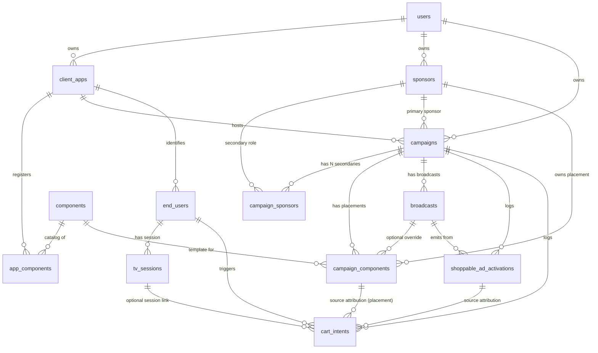

# DB & Endpoints — Developer Reference

Reference map for anyone (new dev, Kotlin dev, integration partner) working
on the Vio backend or the SDKs that consume it. Focus is on the **product
placement + multi-sponsor + cart-intent** slice.

Cross-refs:
- Conceptual model: [`multi-sponsor-architecture.md`](./multi-sponsor-architecture.md)
- End-to-end cart-intent: `VioSwiftSDK/Documentation/CART_INTENT_FLOW.md`
- Apple TV SDK runtime: `InteractiveAds-vio/docs/SDK_ARCHITECTURE.md`
- Kotlin SDK specs: [`KOTLIN_TV_SDK_SPEC.md`](./KOTLIN_TV_SDK_SPEC.md), [`KOTLIN_MOBILE_SDK_SPEC.md`](./KOTLIN_MOBILE_SDK_SPEC.md)

---

## 1. Hierarchy in one picture

```
┌─────────────────────────────────────────────────────────────┐
│  users  (operator accounts — dashboard auth)                │
└─┬───────────────────────────────────────────────────────────┘
  │ owns
  ├─► client_apps   ────────── tvEnabled, webhookUrl, apiKey ──┐
  │   │                                                         │
  │   │ registers                                               │ calls
  │   ├─► app_components  ←── (admin-only) which components     │ backend
  │   │                        from the catalog this app can   │ with
  │   │                        use                             │ apiKey
  │   │                                                         │
  │   └─► campaigns                                             │
  │       │   primarySponsorId (NOT NULL, immutable)            │
  │       │                                                     │
  │       ├─► campaign_sponsors (M:N secondary sponsors)        │
  │       │                                                     │
  │       ├─► campaign_components  ← product placements         │
  │       │     sponsorId + componentId + locationId +          │
  │       │     status + scheduledTime + optional broadcastId   │
  │       │                                                     │
  │       ├─► broadcasts   (live events under the campaign)     │
  │       │     │                                               │
  │       │     ├─► broadcast_sponsor_slots  (shoppable TV ads) │
  │       │     ├─► polls, contests          (engagement)       │
  │       │     └─► shoppable_ad_activations (dispatch log)     │
  │       │                                                     │
  │       └─► cart_intents (attribution log)                    │
  │                                                             │
  └─► sponsors  ──────── avatarUrl, logoUrl, commerceApiKey ────┘
         (the brand — per-sponsor Commerce credentials live here)
```

**Rule of thumb per table**:
- `users` = dashboard operator account (one human).
- `client_apps` = a mobile/TV app instance (TV2, Viaplay, etc.) with its own `apiKey`.
- `sponsors` = a brand with its own Commerce catalog.
- `campaigns` = time-bounded marketing activation under an app with 1 primary + N secondary sponsors.
- `components` = platform-wide template catalog (types: product_carousel, product_banner, etc.).
- `app_components` = which templates an app can use.
- `campaign_components` = actual placement: component + sponsor + location inside a campaign.
- `broadcasts` = a live event under a campaign (a match, a show).
- `end_users` = an SDK viewer identity (opaque externalUserId, per client_app).
- `tv_sessions` = active TV SDK session (for heartbeat + cart-intent routing).
- `shoppable_ad_activations` = one row per shoppable ad dispatch.
- `cart_intents` = one row per "Add to cart" tap with full attribution.

---

## 2. Schema diagram (tables + FKs relevant to the flow)



### 2.1 Column summary (key columns only)

#### `client_apps`
`id, userId → users, name, bundleId, apiKey, webhookUrl, partnerDeviceRegisterUrl, tvEnabled, tvPlatforms (text[])`

#### `sponsors`
`id, userId → users, name, logoUrl, avatarUrl, primaryColor, secondaryColor, commerceApiKey, commerceChannelId, paymentMethods (json: ['card','klarna','vipps','apple_pay','google_pay'])`

- `avatarUrl` = square brand mark (overlays / product cards).
- `logoUrl` = wide horizontal logo (headers / full-screen).
- `commerceApiKey` present → sponsor can drive shoppable flows. Null → visual-only.

#### `campaigns`
`id, userId, clientAppId → client_apps, primarySponsorId → sponsors (NOT NULL, immutable once children exist), name, startDate, endDate, isPaused, targetCountries (text[]), webhookUrl`

#### `campaign_sponsors` (M:N)
`id, campaignId → campaigns, sponsorId → sponsors, role ('engagement' | 'shoppable' | 'full')`

#### `components` (catalog, platform-wide)
`id varchar(50) default gen_random_uuid(), type (product_carousel | product_spotlight | product_store | product_banner | product_slider | banner | countdown | offer_banner | offer_badge), name, config (json), isTemplate`

#### `app_components` (manifest-populated)
`id, clientAppId → client_apps, componentId → components, customConfig (json)`

Populated by SDK manifest upload at app boot via `POST /v2/mobile/components/manifest`. Each call upserts the rows for the component types the app declares via `VioPlacementRegistry.register(_:)`. Idempotent — re-registering is a no-op.

#### `app_component_locations` (manifest-populated)
`id, clientAppId → client_apps, locationId varchar, displayName varchar nullable` — UNIQUE `(client_app_id, location_id)`.

Populated by the same manifest upload. Lists which slot ids the app exposes via `VioPlacementRegistry.registerLocation(_:)`. The dashboard's "Add placement" location picker reads from here so an operator can never bind a `campaign_components` instance to a slot the dev's code doesn't actually render to.

#### `campaign_components` ⭐ the placement table
| column | type | notes |
|---|---|---|
| `id` | serial | placement row id |
| `campaignId` | integer FK | |
| `componentId` | varchar FK → `components` | which template |
| `sponsorId` | integer FK → `sponsors` | **NOT NULL** (Phase 3). Must be primary or in `campaign_sponsors` — enforced by `isSponsorAllowedForCampaign` |
| `broadcastId` | varchar FK → `broadcasts` **nullable** | null = campaign-wide, set = broadcast-scoped override |
| `locationId` | varchar | SDK slot (e.g., `home-hero`, `sport-detail-banner`) |
| `instanceName` | varchar | human-readable label |
| `status` | varchar | `active` \| `inactive` |
| `customConfig` | json nullable | overrides `components.config` |
| `scheduledTime` | timestamp nullable | auto-activate at this time |
| `endTime` | timestamp nullable | auto-deactivate at this time |
| `videoStartTime`, `videoEndTime` | integer | seconds relative to broadcast video |
| `matchId` | varchar | optional external match id |

#### `broadcasts`
`broadcastId varchar PK, campaignId → campaigns nullable, startTime, endTime, status (upcoming | live | ended), engagementEnabled, showLineup, viewerCount, peakViewers, matchStartingAt, home/awayTeamName + logo, leagueName, sportmonksFixtureId`

#### `end_users`
`id, clientAppId → client_apps, externalUserId varchar (opaque partner user id), firstSeenAt, lastSeenAt, metadata (json)` — unique on `(clientAppId, externalUserId)`.

#### `tv_sessions`
`id, clientAppId, endUserId → end_users, tvDeviceId, platform (apple-tv | android-tv), startedAt, lastSeenAt, endedAt`

#### `shoppable_ad_activations`
`id, broadcastId, campaignId, sponsorId, clientAppId, slotId → broadcast_sponsor_slots nullable, productId (external Commerce id), productSnapshot (json), sponsorSnapshot (json), source (admin-api | dashboard | tv-sdk | slot-scheduler), wsEventSent, triggeredAt`

One row per shoppable ad dispatch. `productSnapshot` + `sponsorSnapshot` freeze the data at dispatch time for audit.

#### `cart_intents`
`id, endUserId → end_users, campaignId, clientAppId, tvSessionId → tv_sessions nullable, sponsorId, productId, sourceActivationId → shoppable_ad_activations nullable, sourceComponentId → campaign_components nullable, deliveryMode (websocket | dual | webhook | apns | dropped), userConnected, envelope (json, canonical v1), metadata, triggeredAt`

`sourceActivationId` closes the TV → Mobile attribution chain. `sourceComponentId` closes the placement → cart attribution chain.

---

## 3. Endpoints by audience

Auth column: `apiKey` = `X-API-Key` header; `session` = dashboard cookie; `Bearer` = JWT.

### 3.1 Admin / app setup (session)

| method | path | what |
|---|---|---|
| GET | `/api/client-apps` | list apps |
| POST | `/api/client-apps` | create app |
| GET | `/api/client-apps/:id` | app detail |
| PATCH | `/api/client-apps/:id` | update app |
| POST | `/api/client-apps/:id/regenerate-key` | rotate apiKey |
| DELETE | `/api/client-apps/:id` | delete app |
| GET | `/api/client-apps/:id/components` | list app_components (accepts `?withLocations=true` to also embed declared locations) |
| GET | `/api/client-apps/:id/component-locations` | list app_component_locations declared by the SDK manifest (dashboard "Add placement" location picker source) |
| POST | `/api/client-apps/:id/components` | register a component to the app (admin-side; same effect as the SDK manifest) |
| DELETE | `/api/client-apps/:id/components/:componentId` | unregister |
| POST | `/api/components` | create catalog template |
| GET | `/api/components` / `/:id` | list / detail catalog |
| PATCH / DELETE | `/api/components/:id` | update / delete template |

### 3.2 Dashboard operator (session)

#### Sponsors
| method | path | what |
|---|---|---|
| GET / POST | `/api/sponsors` | list / create sponsor |
| GET / PATCH / DELETE | `/api/sponsors/:id` | detail / update / delete |
| GET | `/api/campaigns/:id/sponsors` | sponsors linked to campaign |
| POST | `/api/campaigns/:id/sponsors` | add secondary sponsor |
| DELETE | `/api/campaigns/:id/sponsors/:sponsorId` | remove secondary |

#### Campaigns
| method | path | what |
|---|---|---|
| GET / POST | `/api/campaigns` | list / create |
| GET | `/api/campaigns/:id` | detail with sponsors |
| PUT | `/api/campaigns/:id` | update (immutable primary sponsor if children exist) |
| DELETE | `/api/campaigns/:id` | delete cascade |
| PATCH | `/api/campaigns/:id/toggle-pause` | pause/resume |

#### Placements (`campaign_components`)
| method | path | what |
|---|---|---|
| GET | `/api/campaigns/:id/components` | list placements |
| POST | `/api/campaigns/:id/components` | **create placement** (needs `componentId` + `sponsorId`, optional `locationId`, `broadcastId`, `scheduledTime`, `endTime`, `customConfig`) |
| PATCH | `/api/campaigns/:id/components/:componentId` | toggle status / update schedule — **fires WS `component_status_changed`** |
| PATCH | `/api/campaigns/:id/components/:componentId/config` | override customConfig |
| DELETE | `/api/campaigns/:id/components/:componentId` | remove placement |
| GET | `/api/campaigns/:id/active-components` | list currently active |

#### Broadcasts
| method | path | what |
|---|---|---|
| GET / POST | `/api/broadcasts` | list / create |
| GET / PUT / DELETE | `/api/broadcasts/:broadcastId` | detail / update / delete |
| GET / POST / PUT / DELETE | `/api/broadcasts/:broadcastId/sponsor-slots[/:slotId]` | shoppable ad slot CRUD |
| POST | `/api/broadcasts/:broadcastId/sponsor-slots/:slotId/execute` | dispatch slot now |
| POST | `/api/broadcasts/:broadcastId/trigger-shoppable-ad` | ad-hoc dispatch |
| GET | `/api/broadcasts/:broadcastId/shoppable-ads` | activation log |

### 3.3 Admin API (Bearer JWT)

| method | path | what |
|---|---|---|
| POST | `/api/broadcasts/:broadcastId/shoppable-ad` | programmatic dispatch (platform admin) |

### 3.4 SDK v2 runtime (apiKey)

| method | path | what |
|---|---|---|
| GET | `/v2/mobile/config` | **bootstrap**: active campaign + primary + secondaries + endpoints |
| GET | `/v2/mobile/broadcasts/:broadcastId/capabilities` | per-broadcast feature flags |
| GET | `/v2/mobile/broadcasts/:broadcastId/components` | broadcast-scoped placements (legacy path, may retire) |
| GET | `/v2/mobile/campaigns/:campaignId/components` | **primary placement fetch** — campaign-scoped instances with `templateConfig + customConfig` merged server-side |
| POST | `/v2/mobile/components/manifest` | **SDK boot manifest upload** — registers `app_components` + `app_component_locations` for this clientApp from the body's `{components, locations}` arrays |
| POST | `/v2/mobile/campaigns/:campaignId/register-device` | APNs/FCM token registration for push fallback |
| POST | `/v2/mobile/campaigns/:campaignId/cart-intent` | mobile cart-intent |
| POST | `/v2/tv/broadcast/subscribe` | **TV combined bootstrap** — subscribe + session + wsUrl + identify in one call |
| POST | `/v2/tv/session/{start,heartbeat,end}` | TV session lifecycle |
| POST | `/v2/tv/cart-intent` | TV cart-intent (v2 minimal body: `{ externalUserId, productId, activationId }`) |
| POST | `/v2/tv/broadcasts/:broadcastId/shoppable-ad` | TV SDK ad dispatch |

### 3.5 Commerce proxy (apiKey)

| method | path | what |
|---|---|---|
| GET | `/api/commerce/products` | raw Commerce GraphQL proxy |
| GET | `/api/commerce/sponsors/:sponsorId/catalog` | sponsor-scoped product catalog |

---

## 4. WebSocket events

All WS connections target `wss://<host>/ws/:campaignId`. The client identifies with `{ type: "identify", userId }` after handshake so the backend can route user-scoped events (cart_intent).

### Outbound (server → client)

| event | payload root | when |
|---|---|---|
| `campaign_started` | `campaignId, startDate, endDate, matchId?` | campaign starts |
| `campaign_ended` | `campaignId, endDate` | campaign ends |
| `broadcast_status_changed` | `broadcastId, status` | status transitions (upcoming → live → ended) |
| `component_status_changed` | `campaignId, componentId, sponsorId, status, component:{id,type,name,config}` | placement active/inactive (manual toggle, scheduler) |
| `poll_activated` / `poll_deactivated` | `pollId, broadcastId` | engagement |
| `contest_activated` / `contest_deactivated` | `contestId, broadcastId` | engagement |
| `lineup_show` | `broadcastId, videoTimestamp, …` | lineup scheduling |
| `shoppable_ad` | `broadcastId, campaignId, sponsorId, activationId, product, sponsor` | shoppable ad dispatch (TV SDK) |
| `cart_intent` | `vio_notification_version, vio_event_type, vio_payload:{…, activation_id, sponsor_id}` | direct to identified user |
| `ping` | — | app-level keepalive (client responds `{type:"pong"}`) |

### Inbound (client → server)

| event | payload | when |
|---|---|---|
| `identify` | `userId` | first frame after handshake |
| `pong` | — | in response to `ping` |

---

## 5. Placement lifecycle for SDK developers

```
                ┌─── dashboard operator creates/edits placement ─────┐
                │                                                    │
                ▼                                                    ▼
POST /api/campaigns/:id/components          PATCH /.../components/:componentId
        │ (DB insert)                          │ (status toggle)
        └──────────────┬───────────────────────┘
                       ▼
            fires WS `component_status_changed`
                       │
                       ▼
       ┌───────────────────────────────┐
       │ SDK runtime:                  │
       │  1. initial fetch at bootstrap │
       │  2. listen WS, upsert state    │
       │  3. render by locationId       │
       └───────────────────────────────┘
```

**0. Boot — manifest upload.** App init calls `VioPlacementRegistry.register(_:)` for each component type and `registerLocation(_:)` for each slot the layout exposes, then `VioPlacementManifestUploader` posts to `POST /v2/mobile/components/manifest` with `X-API-Key`. Backend upserts `app_components` + `app_component_locations`. Idempotent.

**1. Initial fetch.** As part of `fetchAndApplySdkBootstrapNow`, the SDK calls `GET /v2/mobile/campaigns/:campaignId/components`. Backend merges `templateConfig + customConfig` server-side so the iOS `ComponentConfig` decoder sees a complete object. SDK upserts `activeComponents`, deduping by **`(id, locationId)`** composite key (so 2 instances of the same template in different slots coexist).

**2. WS updates.** The SDK connects to `wss://<host>/ws/:campaignId`, sends `{type:"identify", userId}`. It listens for `component_status_changed` (which carries `sponsorId` at root since 2026-04-23) and upserts its local placement map by `(id, locationId)` — same composite key.

**3. Scheduler-driven.** `server/scheduler.ts` runs periodically; when a placement's `scheduledTime` is reached it flips `status → active` and emits the WS event. At `endTime` same pattern to `inactive`.

**4. Render.** Each UI slot (`VProductCarousel(locationId: "home_top")` in iOS, equivalent on Android) calls `getActiveComponent(type:locationId:)` against the local placement map. If found and `active`, render with `placement.sponsor.{avatarUrl, primaryColor}` + pass `sponsor.id` to `ProductService.loadProducts(sponsorId:)` so GraphQL routes through that sponsor's `commerceApiKey`.

**5. Missing or offline.** If no placement for a `locationId`, render nothing (or a host-app fallback). If the WS drops, poll `/v2/mobile/campaigns/:campaignId/components` on reconnect to re-sync.

---

## 6. Cart-intent attribution chain

```
shoppable_ad dispatched (slot, tv-sdk, dashboard, admin-api)
  → shoppable_ad_activations INSERT (id = X)
  → WS `shoppable_ad` { activationId: X, sponsorId, product } to connected clients
  ↓
user taps "Add to cart" (TV SDK or mobile placement)
  → POST /api/sdk/tv/cart-intent { externalUserId, productId, activationId: X }
  ↓
backend:
  → resolve campaignId + sponsorId from activation row
  → ensureEndUser
  → INSERT cart_intents { sourceActivationId: X, sponsorId, deliveryMode, envelope }
  → forward envelope to mobile (direct WS or webhook/APNs)
  ↓
mobile SDK receives WS `cart_intent`
  → dedup by activationId
  → open product detail with sponsor.id → per-sponsor Commerce client
  → Apple Pay gate reads paymentMethods from sponsor block
```

Also supported: placement-originated cart intents carry `sourceComponentId` (the placement row id) instead of `sourceActivationId`.

---

## 7. How-to recipes

### Add a sponsor to a campaign
1. Sponsor exists in `sponsors` (created in Sponsors page).
2. Dashboard → campaign detail → **Sponsors** tab → Add → pick sponsor + role (`shoppable` / `engagement` / `full`).
3. Backend: `POST /api/campaigns/:id/sponsors { sponsorId, role }` → inserts `campaign_sponsors`.

### Register a component to an app (admin-only)
1. Template exists in `components` (create in Component Library).
2. Admin → app detail → Components → "Add Component".
3. Backend: `POST /api/client-apps/:id/components { componentId }` → inserts `app_components`.

### Create a placement on a campaign
1. Campaign has ≥1 sponsor (previous recipe).
2. App has ≥1 component registered (previous recipe).
3. Dashboard → campaign → **Components** tab → Add → pick sponsor + component + location + (optional) schedule.
4. Backend: `POST /api/campaigns/:id/components { componentId, sponsorId, locationId, ... }` → validates sponsor ∈ campaign sponsors → inserts `campaign_components` → if `status='active'`, broadcasts WS.

### Dispatch a shoppable ad from the dashboard
1. `POST /api/broadcasts/:id/trigger-shoppable-ad { productId, sponsorId }` (ad-hoc), or
2. `POST /api/broadcasts/:id/sponsor-slots/:slotId/execute` (pre-configured slot).
3. Both go through `persistAndBroadcastShoppableAd` → inserts `shoppable_ad_activations` → fans out WS `shoppable_ad` to connected clients.

### Close the cart-intent attribution loop
Client-side (TV or mobile): pass the `activationId` of the originating shoppable_ad (or `sourceComponentId` if the intent came from a placement) in the cart-intent POST body. Backend writes it into `cart_intents` for analytics.

---

## 8. Minimum-viable demo data for a new env

Post Phase 1+2+3 schema migration, a working demo needs:

1. One `users` row (operator).
2. One `client_apps` row with `tvEnabled=true, tvPlatforms=['apple-tv']` + apiKey.
3. At least 2 `sponsors` — at least one with `commerceApiKey` set.
4. One `campaigns` with `primarySponsorId` pointing to one of those sponsors, `isPaused='false'`, `startDate <= now <= endDate`, `clientAppId` linking to the app.
5. Optional: one `campaign_sponsors` row to add a secondary sponsor.
6. At least 1 `components` template of type `product_*`.
7. One `app_components` row linking the app to that component.
8. One `campaign_components` row linking everything: campaign + component + sponsor + locationId. Status `active` or scheduled.
9. One `broadcasts` row with `campaignId` set, status `live` or `upcoming`.

Validate by calling `GET /v2/sdk/config?apiKey=<key>` — you should get the campaign + primary + secondary sponsors + all commerce blocks.
